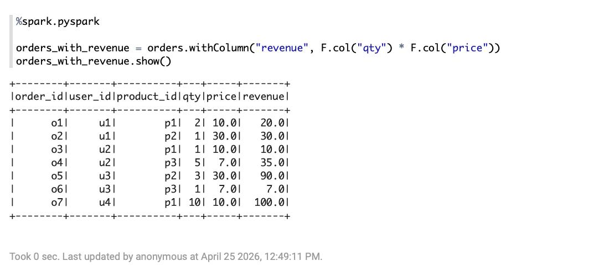
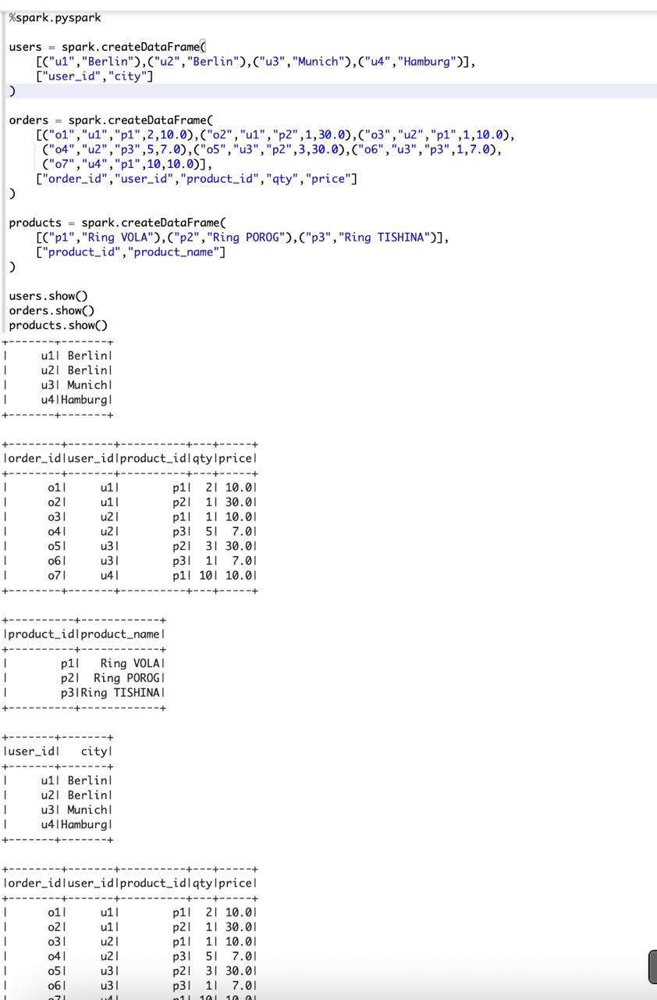
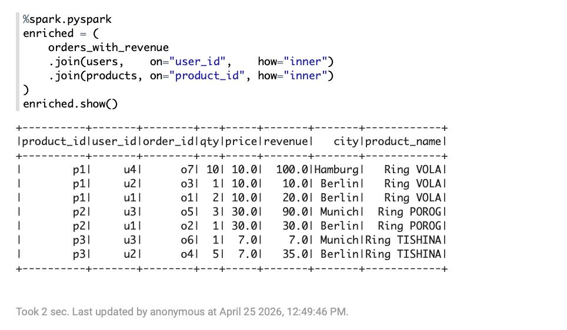
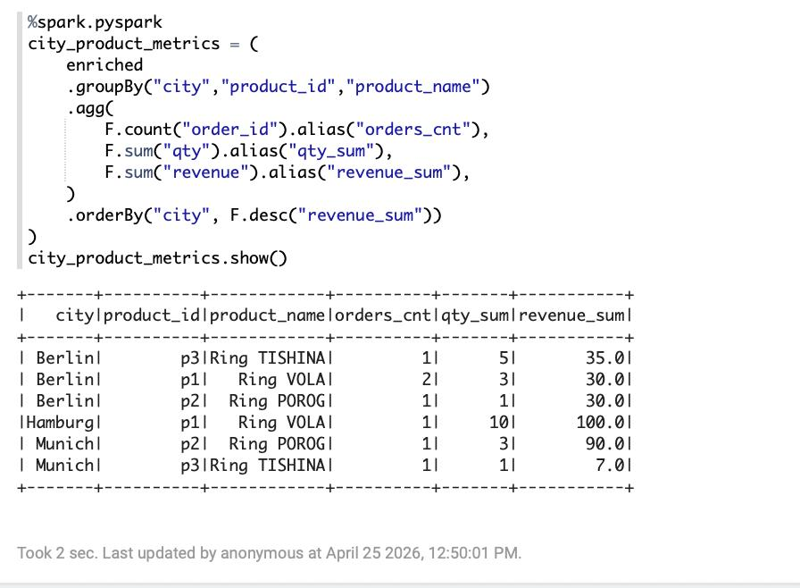
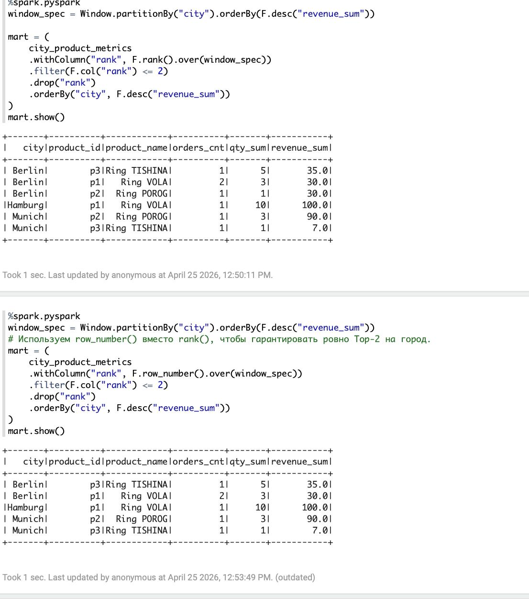
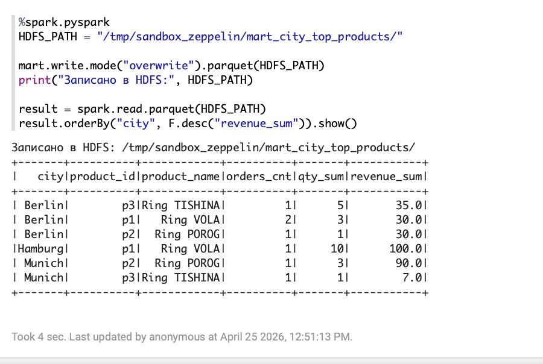

# Структура
 
```
├── mart_city_top_products_2MR23YG1K.zpln
├── screenshots/
│   ├── 2026-04-25_13_19_10.jpg
│   ├── 2026-04-25_13_19_26.jpg
│   ├── 2026-04-25_13_19_30.jpg
│   ├── 2026-04-25_13_19_38.jpg
│   ├── 2026-04-25_13_19_45.jpg
│   └── 2026-04-25_13_19_49.jpg
└── README.md
```
 
## Результаты
 
### 1. Revenue = qty × price

 
### 2. Исходные данные

 
### 3. JOIN orders → users → products

 
### 4. Агрегация по городу и товару

 
### 5. Top-2 по городу (оконная функция)

 
### 6. Запись в HDFS и чтение обратно

